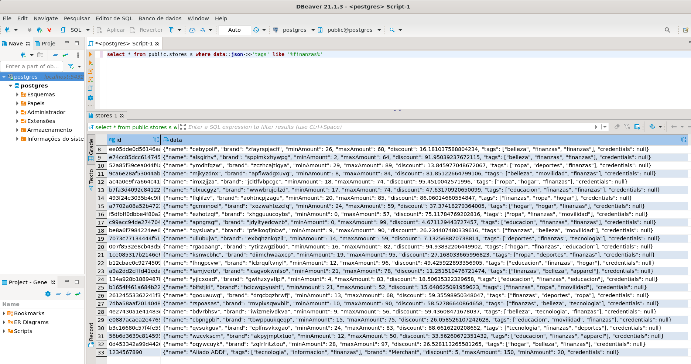
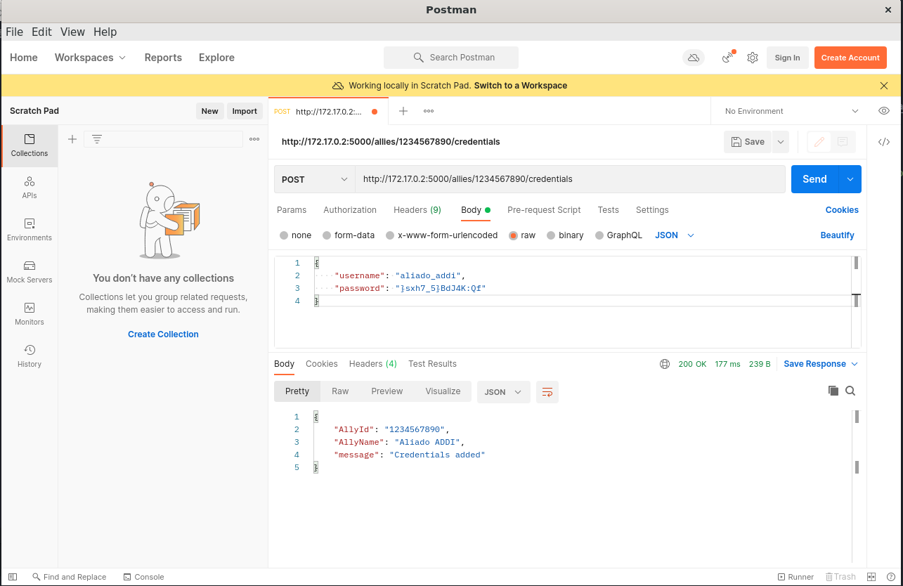

# Resolution SE-Technical-challenge - Gabriel Padilha Santos

## Description

This README file has the intention to describe how you can configure a new ally into our platform.

### Adding new ally

To add a new ally, you need to run the sql statement below on the database. This will create a new record on `stores` table filling the ID column with our ally identifier and the column DATA with a JSON containing all the other information related to ally:

``` sql
INSERT INTO
	public.stores(id,data)
VALUES ('1234567890', 
    jsonb_build_object(
        'name', 'Aliado ADDI', 
        'brand', 'Merchant',
        'minAmount', 20,
        'maxAmount', 150,
        'discount', 5,
        'tags', json_build_array('tecnologia', 'informacion', 'finanzas'),
        'credentials', null
    )
)
```

**Obs**: This is an example, you will need to change the data above according to the ally being added

### Querying all allies with finazas tag

When you need to query all allies that contains `finanzas` tag, run the sql below on the database and the data will be retrieved:

``` sql
SELECT * FROM public.stores s WHERE data::json->>'tags' LIKE '%finanzas%'
```

Result example:


### Adding a credential to ally

After you insert the ally information to the `stores` table, you can add the credential to it using the following command:
```sh
curl -X POST -H "Content-type:application/json" --data-binary "{\"username\": \"aliado_addi\", \"password\": \"}sxh7_5}BdJ4K:Qf\"}" http://localhost:5000/allies/1234567890/credentials
```
With this command a POST request is made to our API sending the username and password of the ally. When the request hits the API endpoint(**/allies/{allyId}/credentials**), the password is encryted(hashed) and the column credential from table `stores` will be updated with this password encrypted data.

If everything was okay, you will see the message below:
```sh
gabrielpadilha@ubuntu-note:~/Downloads$ curl -X POST -H "Content-type:application/json" --data-binary "{\"username\": \"aliado_addi\", \"password\": \"}sxh7_5}BdJ4K:Qf\"}" http://localhost:5000/allies/1234567890/credentials
{
  "AllyId": "1234567890", 
  "AllyName": "Aliado ADDI", 
  "message": "Credentials added"
}
gabrielpadilha@ubuntu-note:~/Downloads$ 

```


If want to add the credential using a more friendly tool, i recommend postman like below:


## NOTES
- SQL script to add a new ally - [INSERT_NEW_ALLY](insert.sql).
- SQL query to list all allies with the tag "finanzas" - [ALLY_TAG_FINANZAS](select_tags_like_finanzas.sql)
- HTTP Request that adds a given ally's credentials through our API 

